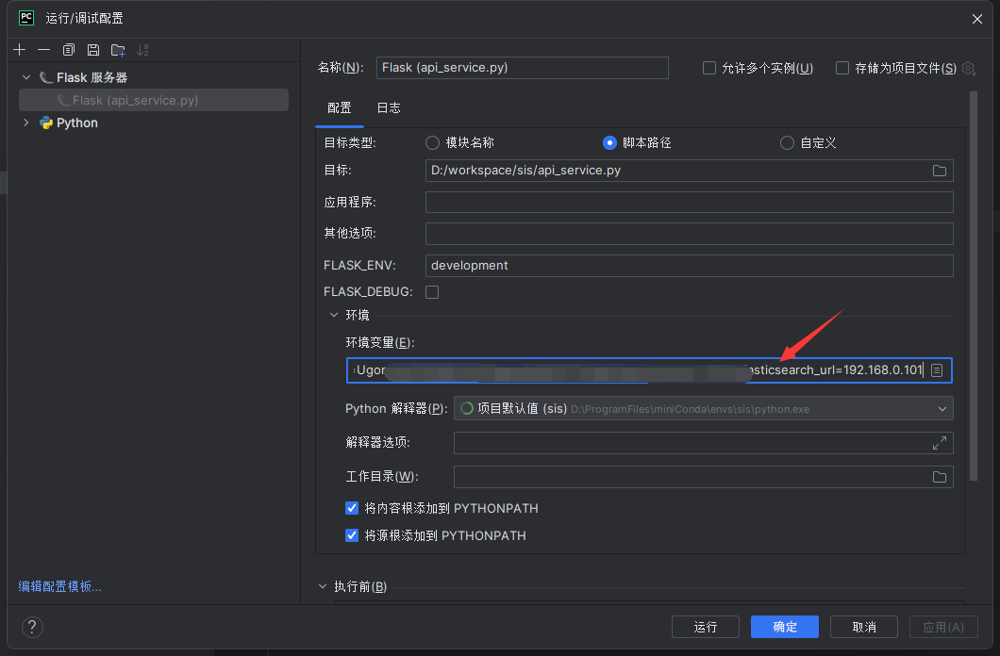
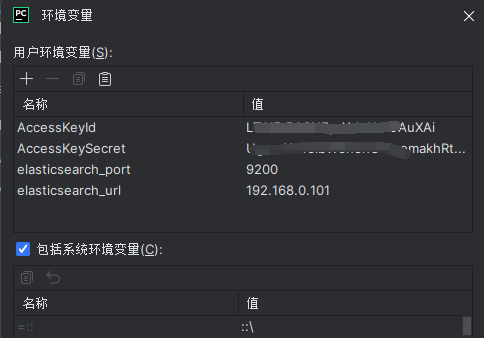

# 本地以图搜图

框架使用 sentence_transformers

模型使用 clip-ViT-B-32

图片特征向量直接存储在 elasticsearch，版本7.4.2

图片存储在阿里云OSS

elasticsearch 索引构建请参考 elasticsearch.txt 文件

## 使用说明

1、在启动配置中添加以下五个参数

* AccessKeyId：必填
* AccessKeySecret：必填
* elasticsearch_url：elasticsearch地址（必填）
* elasticsearch_port：elasticsearch端口（必填）
* model_path：模型地址（可选）





2、运行api_service.py文件即可

## 提示

不保证上传图片名称唯一，请确认上传图片名称不重复，防止覆盖

## docker

1、构建镜像

```shell
docker build . -t xjhqre/sis:v1.0
```

2、运行容器

```shell
docker run -d -p 5000:5000 --name sis xjhqre/sis:v1.0
```

如果运行后报错模型下载不了，可以手动到
https://huggingface.co/sentence-transformers/clip-ViT-B-32/tree/main
下载所有文件，将文件夹复制到docker容器中，地址与model_path对应