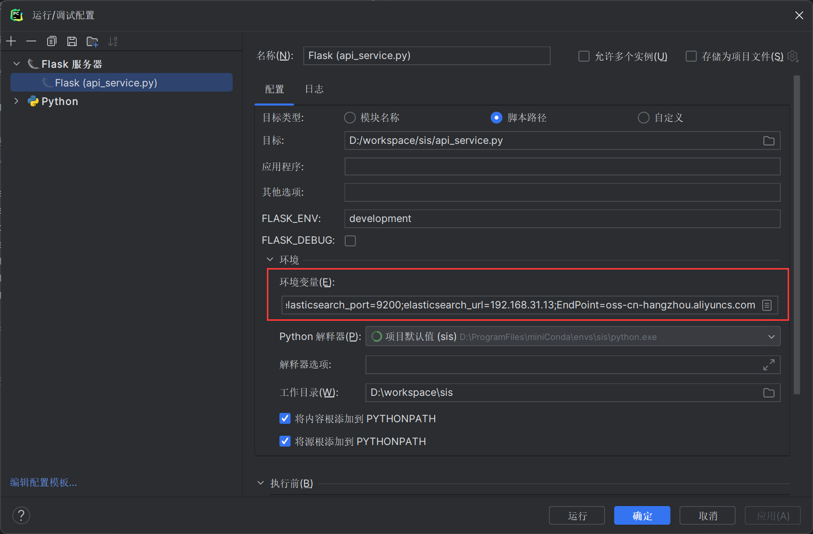

# 本地以图搜图

模型使用 resnet50

图片特征向量存储和搜索使用 elasticsearch，版本7.4.2

图片存储在阿里云OSS

elasticsearch 索引构建请参考 elasticsearch.txt 文件

使用说明
1、在启动配置中添加以下几个参数

AccessKeyId：必填
AccessKeySecret：必填
EndPoint：必填
bucket：必填
elasticsearch_index：索引名称(必填)
elasticsearch_url：elasticsearch地址（必填）
elasticsearch_port：elasticsearch端口（必填）

2、运行api_service.py文件即可

提示
不保证上传图片名称唯一，请确认上传图片名称不重复，防止覆盖